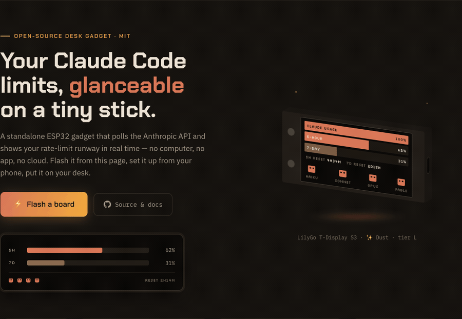

<div align="center">

# Claude Usage Stick

**Your [Claude Code](https://docs.anthropic.com/en/docs/claude-code) rate limits, glanceable on a tiny ESP32 stick.**

[](https://oauramos.github.io/claude-usage-stick/)
[](https://github.com/oauramos/claude-usage-stick/wiki)
[](https://github.com/oauramos/claude-usage-stick/wiki/Supported-Boards)
[](LICENSE)

<a href="https://oauramos.github.io/claude-usage-stick/"></a>

*5-hour & 7-day usage windows · reset countdowns · model health mascots · PIN-encrypted token · web control panel · screen carousel with 7-day chart, Anthropic news & clock (✨ Dust, v3)*

</div>

---

A standalone desk gadget that polls the Anthropic API and shows your Claude Code rate-limit usage in real time — no computer, no app, no cloud. Flash it, connect it to WiFi from your phone, and it just sits there telling you how much runway you have left.

## What it does

**On every board**

- **Live usage bars** — the 5-hour and 7-day rate-limit windows, read straight from the `anthropic-ratelimit-unified-*` headers, refreshed every 30 s – 5 min
- **Reset countdowns** — exactly how long until each window frees up
- **Model health mascots** — Haiku / Sonnet / Opus / Fable from status.claude.com as blinking Clawds (Mango v2+)
- **PIN-encrypted token** — AES-256-GCM on the device's own flash; the PIN is never stored, and 10 wrong tries wipes it
- **Captive-portal setup** — no hardcoded credentials, no serial console; configure it from your phone

**✨ New in Dust (v3 — [T-Display S3](https://github.com/oauramos/claude-usage-stick/wiki/LilyGo-T-Display-S3) and [M5StickC Plus](https://github.com/oauramos/claude-usage-stick/wiki/M5StickC-Plus))**

- **[Web control panel](https://github.com/oauramos/claude-usage-stick/wiki/Web-Panel)** — the stick serves its own settings page at `http://claude-usage-stick.local`: every setting, WiFi changes and factory reset from any browser on your LAN. Logging in with the PIN also unlocks the screen
- **Token rotation without a reset** — paste a fresh `claude setup-token`, confirmed with your PIN and verified live against the API; the stored token is write-only
- **Screen modes** — static, carousel (dwell 5–30 s) or desk clock; Button A steps through every screen
- **7-day usage chart** — one sample every 30 minutes, persisted on-device; time spent off shows as honest gaps
- **Anthropic news** — the latest headlines, streamed from the official feed every 6 h
- **Clock & timezone** — local time on the clock screen and on the chart's day markers
- **WiFi recovery** — an unreachable network opens a reconfigure portal (token, PIN and settings survive) instead of a reboot loop
- **Quality of life** — brightness and screen flip persist across reboots, the header alternates device name ↔ address, mDNS, and the board's full 16 MB flash + 8 MB PSRAM are finally in use

## Get one running

### ⚡ Flash it from your browser

**[oauramos.github.io/claude-usage-stick](https://oauramos.github.io/claude-usage-stick/)** — pick your board, plug it in over USB-C, hit Flash. Nothing to install; Chrome or Edge on desktop.

### Or build from source

```bash
git clone https://github.com/oauramos/claude-usage-stick.git
cd claude-usage-stick

pio run -e <env> -t upload      # firmware
```

Needs the [PlatformIO CLI](https://platformio.org/install/cli). Board envs are listed in [Supported boards](https://github.com/oauramos/claude-usage-stick/wiki/Supported-Boards).

Either way, the device then opens its own WiFi network so you can configure it from your phone — see [Setup and daily use](https://github.com/oauramos/claude-usage-stick/wiki/Setup-and-Daily-Use).

## Documentation

Everything lives in the **[wiki](https://github.com/oauramos/claude-usage-stick/wiki)**:

| | |
| --- | --- |
| [Features](https://github.com/oauramos/claude-usage-stick/wiki/Features) | What the device shows |
| [The UI](https://github.com/oauramos/claude-usage-stick/wiki/The-UI) | Firmware versions and display tiers |
| [Web panel](https://github.com/oauramos/claude-usage-stick/wiki/Web-Panel) | The in-browser control panel (✨ Dust boards) |
| [Supported boards](https://github.com/oauramos/claude-usage-stick/wiki/Supported-Boards) | The lineup, with a guide for each board |
| [Flashing](https://github.com/oauramos/claude-usage-stick/wiki/Flashing) | Web flasher and building from source |
| [Setup and daily use](https://github.com/oauramos/claude-usage-stick/wiki/Setup-and-Daily-Use) | Captive-portal setup, PIN, controls |
| [How it works](https://github.com/oauramos/claude-usage-stick/wiki/How-It-Works) | The API request and the headers it reads |
| [Security](https://github.com/oauramos/claude-usage-stick/wiki/Security) | How your OAuth token is encrypted on-device |
| [Troubleshooting](https://github.com/oauramos/claude-usage-stick/wiki/Troubleshooting) | When something doesn't work |

Wiki pages are written in [`wiki/`](wiki/) and published automatically, so docs get reviewed in PRs like any other change.

## Contributing

PRs welcome — especially new board support and photos of real builds. See [Project structure](https://github.com/oauramos/claude-usage-stick/wiki/Project-Structure) for the repo layout and what adding a board involves.

## License

[MIT](LICENSE)
